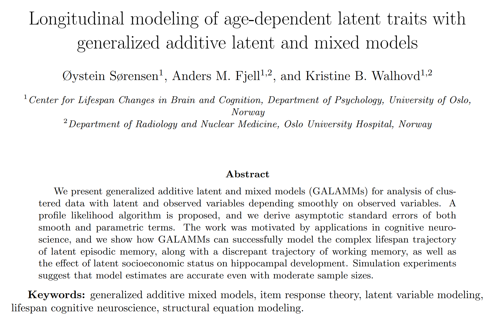
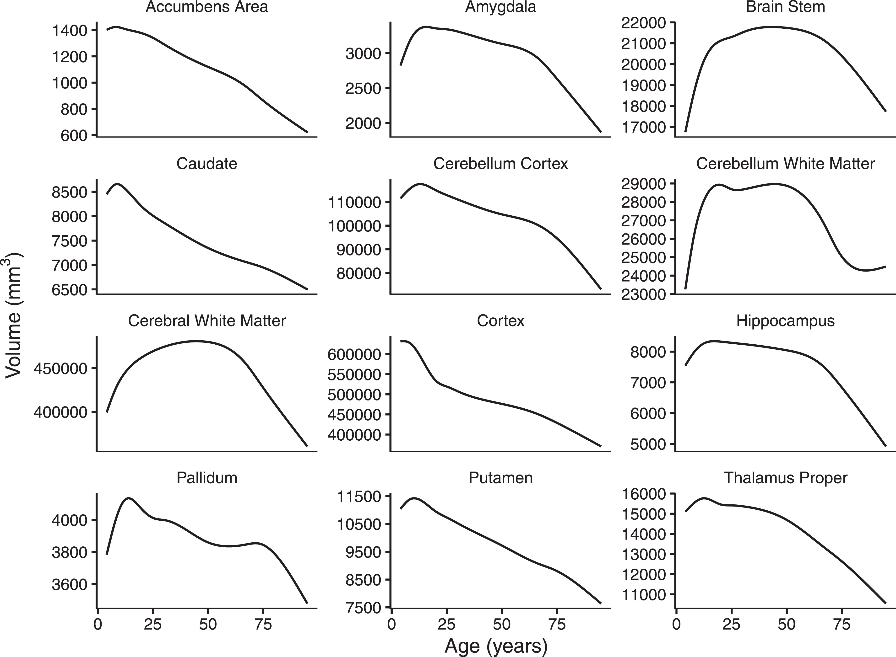
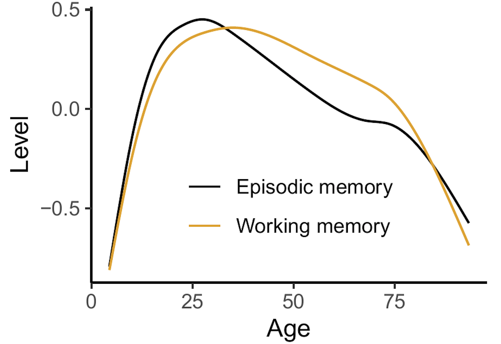
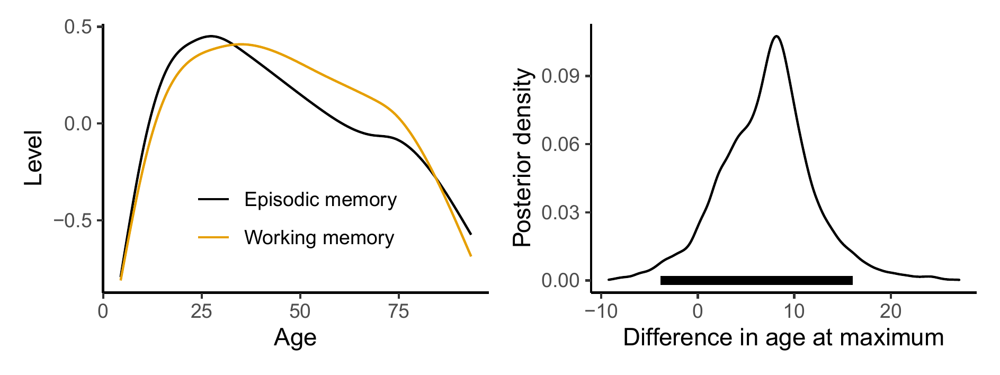
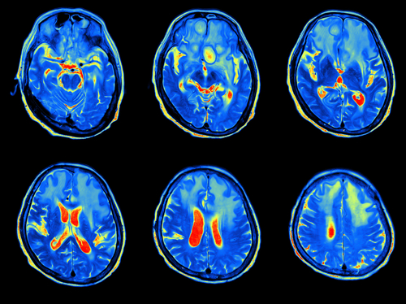
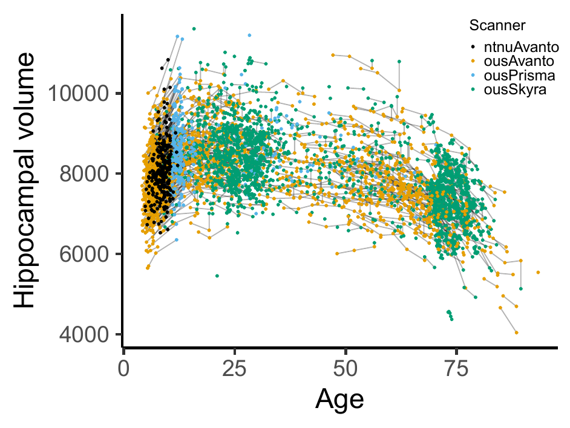

class: inverse, middle, center

# Introduction

---

.footnote[https://arxiv.org/abs/2105.02488]

---

# Latent Variable Models

Multiple observations measure a latent trait, e.g.

- Cognitive abilities follow from responses to different tests.

- Attitudes measured by responses to survey questions.

Classical tools

  - Factor analysis
  
  - Item response theory
  
  - Structural equation models.

---

# Lifespan variation is smooth and nonlinear
Parametric models not well suited to capture such curves.
.pull-left[
<h3>Brain regions</h3>

  
  ]
.pull-right[
<h3>Cognitive abilities</h3>

]

---

# Semiparametric Latent Variable Models

Example: California verbal learning test of episodic memory

  - Five trials at a single test session.
  
  - Latent episodic memory seems to depend smoothly on age.
  

Question: How does latent episodic memory vary across the lifespan?

---

class: inverse, middle, center

# Generalized Additive Latent and Mixed Models

---

# General Framework

- A combination of generalized additive mixed models1 and generalized linear latent and mixed models2.

- Multilevel models with components varying at $L$ levels. $\boldsymbol{\eta}^{(l)}$ denotes a vector of latent variables varying at level $l$, and the vector of all latent variables belonging to a given level-2 unit is

$$\boldsymbol{\eta}_{j} = 
\begin{bmatrix}
\boldsymbol{\eta}_{jk\dots z}^{(2)}{}^{'},
\boldsymbol{\eta}_{k\dots z}^{(3)}{}^{'},
\dots,
\boldsymbol{\eta}_{z}^{(L)}{}^{'}
\end{bmatrix}'$$

.footnote[[1] For an introduction, see [Wood (2017), Generalized Additive Models](https://www.taylorfrancis.com/books/mono/10.1201/9781315370279/generalized-additive-models-simon-wood). 
[2] [Skrondal and Rabe-Hesketh (2004), Generalized Latent Variable Modeling](https://www.taylorfrancis.com/books/mono/10.1201/9780203489437/generalized-latent-variable-modeling-anders-skrondal-sophia-rabe-hesketh).]

---

# Part 1: Response Distribution

Elementary units of observation distributed according to an exponential family.

$$f\left(y_{i} | \theta_{i}, \phi\right) = \exp\left\{\frac{y_{i}\theta_{i} - b\left(\theta_{i}\right)}{\phi} + c\left(y_{i}, \phi\right)  \right\}$$

All responses are stacked in the vector $\mathbf{y} = (y_{1}, y_{2}, \dots, y_{n})'$. Often the responses can be of completely different types, so dummy variables are used extensively in the regression models.

---

# Part 2: Measurement Model

Linking the observed responses to latent variables $\eta_{m}^{(l)}$ of interest.

$$\nu_{i} = \sum_{s=1}^{S} f_{s}\left(\mathbf{x}_{i}\right) + \sum_{l=2}^{L}\sum_{m=1}^{M_{l}} \eta_{m}^{(l)} \mathbf{z}^{(l)}_{mi}{}^{'}\boldsymbol{\lambda}_{m}^{(l)}$$

- Hierarchical model with $L$ levels. Each level $l$ has $M_{l}$ latent variables. Factor loadings $\boldsymbol{\lambda}_{m}^{(l)}$ link the latent variables to the observed measurements.

- Related to confirmatory factor analysis: $\mathbf{y} = \boldsymbol{\Lambda}\boldsymbol{\eta}$.

--

Smooth functions $f_{s}(\cdot)$, e.g., 

$$f_{s}\left(\mathbf{x}_{i}\right) = \sum_{k=1}^{B_{s}} \omega_{ks} b_{ks}\left(\mathbf{x}_{i}\right), ~ s=1, \dots, S.$$

with weights $\omega_{ks}$ constrained by some smoothing penalty.

---

# Part 3: Structural Model

Structural model

$$\boldsymbol{\eta}_{j} = \mathbf{B}\boldsymbol{\eta}_{j} + \mathbf{h}\left(\mathbf{w}_{j}\right)+ \boldsymbol{\zeta}_{j}$$

- $\mathbf{B}$ contains regression coefficients between latent variables.

- $\mathbf{h}\left(\mathbf{w}_{j}\right)$ are smooth functions describing how the latent variables depend on explanatory variables.

- Related to structural equation models: $\boldsymbol{\eta} = \mathbf{B}\boldsymbol{\eta} +\boldsymbol{\Gamma}\mathbf{w}+ \boldsymbol{\zeta}$.

---

# Mixed Model Representation

- Spline smoothing mathematically equivalent to fitting mixed models 1.

- Lets us represent GALAMM as a nonlinear mixed model

$$E\left(y\right) = g^{-1}\left(\nu\right) = f\left(X, \beta\right) + Z\left(\beta\right) \eta, ~~~ \eta \sim N(0, \Psi)$$

- Can fit it with a profile likelihood approach, utilizing efficient mixed model software (`lme4`/`nlme`).

- We use this to derive asymptotic covariance matrices for all functions and parameters.

.footnote[[1] Dating back to [Kimeldorf and Wahba (1970)](https://projecteuclid.org/journals/annals-of-mathematical-statistics/volume-41/issue-2/A-Correspondence-Between-Bayesian-Estimation-on-Stochastic-Processes-and-Smoothing/10.1214/aoms/1177697089.full).]

---

class: inverse, middle, center

# Applications

---

# Episodic Memory

---

# Episodic Memory

Measurement model for elementary unit $i$:

$$\nu_{i} = \underbrace{\mathbf{d}_{ti}'\boldsymbol{\beta}_{t}}_{\text{test version}} + \underbrace{d_{ri}\beta_{r}}_{\text{retest effect}} + \underbrace{\mathbf{d}_{ti}'\boldsymbol{\lambda}}_{\text{factor loading}}\sum_{l=2}^{3} \underbrace{\eta^{(l)}}_{\text{latent level}}$$

In words:

- Linear predictor for the probability of answering correctly on the test is a function of some covariates as well as the true latent level of episodic memory.

---

# Episodic Memory

Structural model for level-2 unit $j$:

$$\boldsymbol{\eta}_{j} = 
\begin{bmatrix}
\eta_{jk}^{(2)} \\
\eta_{k}^{(3)}
\end{bmatrix} 
= 
\underbrace{
\begin{bmatrix}
h\left(w_{jk}\right) \\
0
\end{bmatrix} 
}_{\text{smooth fun. of age}}
+
\underbrace{
\begin{bmatrix}
\zeta_{jk}^{(2)} \\
\zeta_{k}^{(3)}
\end{bmatrix}}_{\text{random intercepts}}$$

For a given participant:

- $\eta_{jk}^{(2)}$ is the latent level of episodic memory at a given timepoint. It consists of a smooth function of age and a random intercept across tests at the given timepoint.

- $\eta_{k}^{(3)}$ is the random intercept of episodic memory across timepoints.

---

# Episodic Memory

Reduced form model

$$\nu_{i} = \mathbf{d}_{ti}'\boldsymbol{\beta}_{t} + d_{ri}\beta_{r} + h\left(w_{jk}\right) \mathbf{d}_{ti}'\boldsymbol{\lambda} + \zeta_{jk}^{(2)}\mathbf{d}_{ti}'\boldsymbol{\lambda} + \zeta_{k}^{(3)} \mathbf{d}_{ti}'\boldsymbol{\lambda}$$

is actually a nonlinear mixed model.

---

# Episodic Memory

Some results, based on 3470 timepoints for 1850 participants between 6 and 93 years of age.

.pull-left[

<h3>Item response curves</h3>

]
.pull-right[

<h3>Lifespan trajectory</h3>

]

---

# Episodic and Working Memory

Important question in cognitive neuroscience: 

- How is change in cognitive performance correlated across cognitive domains?

We extended the previous model to a factor-by-curve model, with some items measuring working memory and others measuring episodic memory.

- Math is in the paper.

---

# Episodic and Working Memory

Density plot (right) obtained with empirical Bayes posterior sampling.

The estimated correlation between random intercepts was 0.41. Hence, people's episodic memory and working memory are positively correlated.

---

class: inverse, middle, center

# Another Application

---

# Socioeconomic Status and Hippocampus

- Hippocampus is a brain region which plays an important role in memory consolidation, and is one of the first regions to be damaged in Alzheimer's disease. 

- It has been suggested that low socioeconomic status is bad for development of the hippocampus, and hence is a risk factor for dementia.

.pull-left[
  
]
.pull-right[
  
]

---

# Socioeconomic Status and Hippocampus

Data from 4196 MRI scans of 1886 participants.

---

# Socioeconomic Status and Hippocampus

- We defined socioeconomic status (SES) as a latent variable measured by income and education level.

- Latent covariate model, with response $y_{i}$ constructed by stacking income, education, and hippocampal volume:

$$y_{i} = \mathbf{d}_{\text{s},i}'\boldsymbol{\beta}_{\text{s}} + d_{h,i}\left\{ \mathbf{x}_{\text{h},i}' \boldsymbol{\beta}_{\text{h}} + f\left(a_{i}\right)\right\} +  \eta_{1}^{(2)} \mathbf{z}_{i}' \boldsymbol{\lambda} + d_{\text{h},i} \eta_{2}^{(2)} + \epsilon_{i}$$

Research question:

  - How does socioeconomic status $\eta_{1}^{(2)}$ interact with the lifespan hippocampal trajectory $f(a_{i})$?
  

---

# Socioeconomic Status and Hippocampus

Conclusion:

- 95% CIs for both the offset effect and the interaction effect contained zero. Hence, not much evidence for an effect of socioeconomic status on hippocampal volume in these data.

---

class: inverse, middle, center

# Summary

---

# Summary

- Generalized additive latent and mixed models allow multilevel latent variable modeling when the latent variables themselves depends smoothly on one or more observed covariates.

  - R package: https://github.com/LCBC-UiO/galamm
  
  - Extensive simulations suggest that asymptotic covariance matrices are highly accurate with moderate sample sizes.

- Further work

  - Develop faster algorithms tailored to typical applications, which also allow mixed response types.
  
  - All smooth functions to depend on latent variables.

---

# References

Sørensen, Ø., Fjell, A. M., & Walhovd, K. B. (2021). <i>Longitudinal modeling of age-dependent latent traits with generalized additive latent and mixed models</i>. ArXiv:2105.02488 [Stat]. http://arxiv.org/abs/2105.02488

Sørensen, Ø., Walhovd, K. B., & Fjell, A. M. (2021). <i>A recipe for accurate estimation of lifespan brain trajectories, distinguishing longitudinal and cohort effects</i>. <b>NeuroImage</b>, 226, 117596. https://doi.org/10.1016/j.neuroimage.2020.117596

Sørensen, Ø., Brandmaier, A. M., Macià, D., Ebmeier, K., Ghisletta, P., Kievit, R. A., Mowinckel, A. M., Walhovd, K. B., Westerhausen, R., & Fjell, A. (2021). <i>Meta-analysis of generalized additive models in neuroimaging studies</i>. <b>NeuroImage</b>, 224, 117416. https://doi.org/10.1016/j.neuroimage.2020.117416

---

class: center, middle

# Thanks!

These slides are available at https://osorensen.rbind.io/.

Created via the R package [xaringan](https://github.com/yihui/xaringan).

